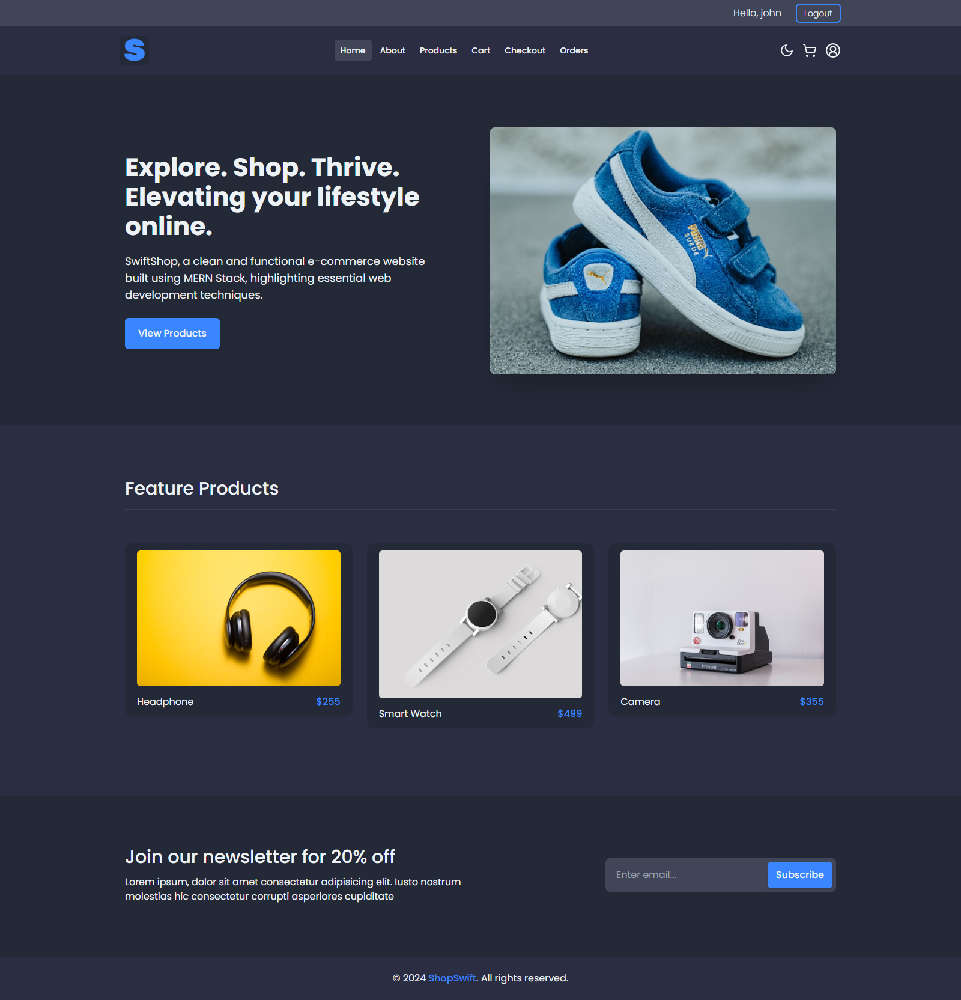
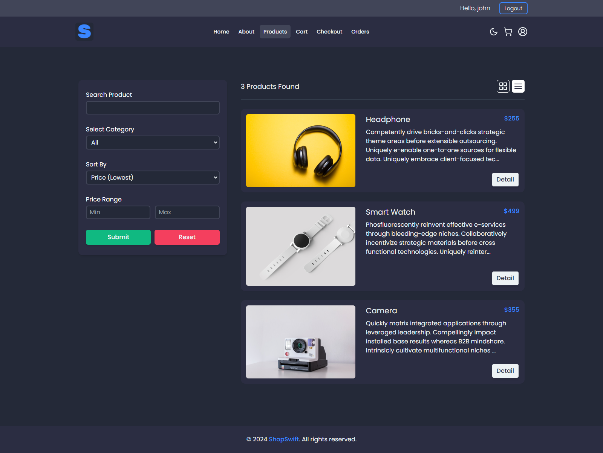

# ShopSwift Frontend

A responsive and user-friendly e-commerce web application built with React.js, TailwindCSS, Redux, and React Router DOM.
ShopSwift offers a complete online shopping experience, enabling users to browse products, manage their shopping carts,
and place orders. This application integrates seamlessly with the ShopSwift backend API to ensure robust data handling
and secure user authentication.

## Table of Contents

- [Features](#features)
- [Technologies Used](#technologies-used)
- [Screenshots](#screenshots)
- [Project Links](#project-links)

## Features

- **User Authentication**: Sign up, log in, and log out functionalities with secure session handling.
- **Responsive Design**: Fully responsive layout optimized for both desktop and mobile devices.
- **Product Listings**: Browse a variety of products with detailed descriptions and prices..
- **Shopping Cart**: Add and remove items from your shopping cart with ease.
- **Order Management**: Place orders.

## Technologies Used

- **[React.js](https://reactjs.org/)**: For dynamic, interactive user interfaces.
- **[TailwindCSS](https://tailwindcss.com/)**: Utility-first CSS for responsive designs.
- **[Redux](https://redux.js.org/)**: Manages global state seamlessly.
- **[React Router DOM](https://reactrouter.com/)**: Declarative routing for navigation.

## Screenshots

  
_Homepage showcasing featured products and a clean interface._

  
_Product listing page displaying available items._

## Project Links

- **Source Code**: [Frontend Repository](https://github.com/sam4web/shopswift-frontend/)
- **Live Preview**: [ShopSwift Live](https://projectshopswift.netlify.app/)
- **Backend Code**: [Backend Repository](https://github.com/sam4web/shopswift-backend)
